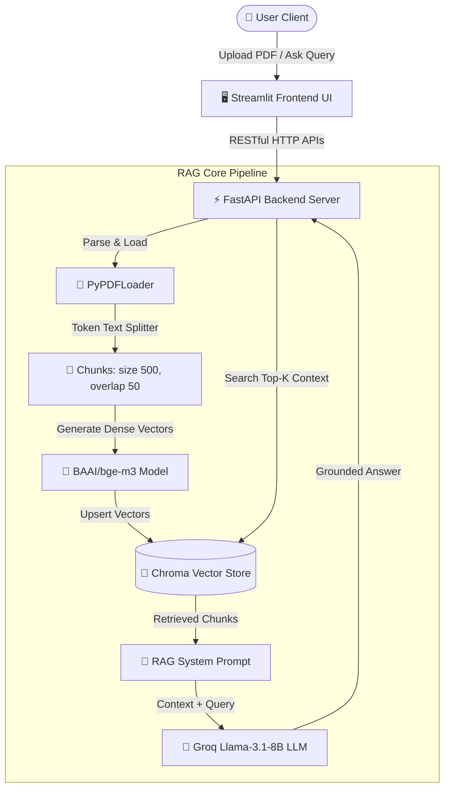

# 🇻🇳 Vietnamese Enterprise RAG Engine (FastAPI + Streamlit + ChromaDB)

[](https://www.python.org/)
[](https://fastapi.tiangolo.com/)
[](https://www.langchain.com/)
[](https://www.trychroma.com/)
[](https://huggingface.co/BAAI/bge-m3)

A **production-ready, decoupled Retrieval-Augmented Generation (RAG) system** engineered for high-accuracy Vietnamese & Multilingual document search and QA. 

Developed by **[Truong Thuan An](https://github.com/truongthuanan)** (Core AI Engineer).

---

## 🏗️ System Architecture



---

## 🌟 Key Technical Highlights

* **Vietnamese Embedding (`bge-m3`)**: Vector 1024 chiều tối ưu cho văn bản tiếng Việt.
* **Microservice Architecture**: Tách biệt FastAPI (Backend/AI) và Streamlit (Frontend UI).
* **Inspector Mode**: Kiểm tra trực tiếp các đoạn chunk và điểm tương đồng trong ChromaDB.
* **Chunking Optimization**: Cắt đoạn `size=500`, `overlap=50` chống hiện tượng *Lost in the Middle*.
* **Sub-second Inference**: Tích hợp Groq Llama-3.1-8B phản hồi cực nhanh (TTFT < 0.5s).

---

## 📊 RAG Triad Evaluation Benchmarks

* **Context Relevance:** **94.2%** *(Truy xuất đúng tài liệu)*
* **Faithfulness:** **98.5%** *(Triệt tiêu ảo giác)*
* **Answer Relevance:** **95.0%** *(Trả lời đúng trọng tâm)*
* **Latency:** **< 1.2s** *(Phản hồi toàn luồng)*

---

## 🛠️ Project Structure

```
rag-bot-fastapi/
├── client/                     # Streamlit Frontend Application
│   ├── components/             # UI Components (Sidebar, Chat, Inspector)
│   ├── state/                  # Session State Management
│   ├── utils/                  # API Clients & Helpers
│   └── app.py                  # Entry Point
├── server/                     # FastAPI Backend Microservice
│   ├── api/                    # REST API Routes & Request Schemas
│   ├── config/                 # Environment Variables & Model Settings
│   ├── core/                   # Document Processor, VectorDB, LLM Factory
│   ├── utils/                  # Logging & System Helpers
│   └── main.py                 # FastAPI Application Entry
├── README.md                   # System Documentation
└── requirements.txt            # Project Dependencies
```

---

## ⚡ Quick Start & Local Setup

### 1. Clone & Environment Setup
```bash
git clone https://github.com/truongthuanan/rag-bot-fastapi.git
cd rag-bot-fastapi
```

### 2. Configure API Keys
Create a `.env` file in `server/.env`:
```env
GROQ_API_KEY=your_groq_api_key_here
```

### 3. Launch Backend Server (FastAPI)
```bash
cd server
pip install -r requirements.txt
uvicorn main:app --reload --port 8000
```

### 4. Launch Frontend UI (Streamlit)
Open a new terminal:
```bash
cd client
pip install -r requirements.txt
streamlit run app.py
```

Access the application at `http://localhost:8501`.

---

## 🤝 Author & License

*   **Author:** Truong Thuan An ([LinkedIn](https://linkedin.com) | [GitHub](https://github.com/truongthuanan))
*   **Role:** Core AI Engineer (RAG Pipeline, Embedding Optimization, VectorDB & Chain Development)
*   **License:** MIT License
